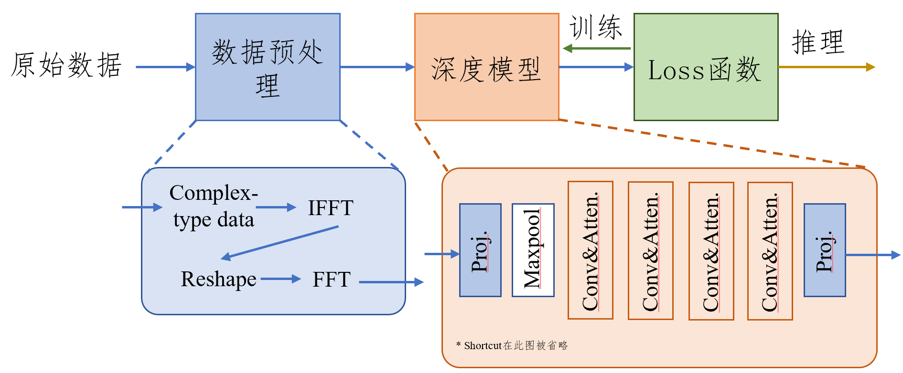
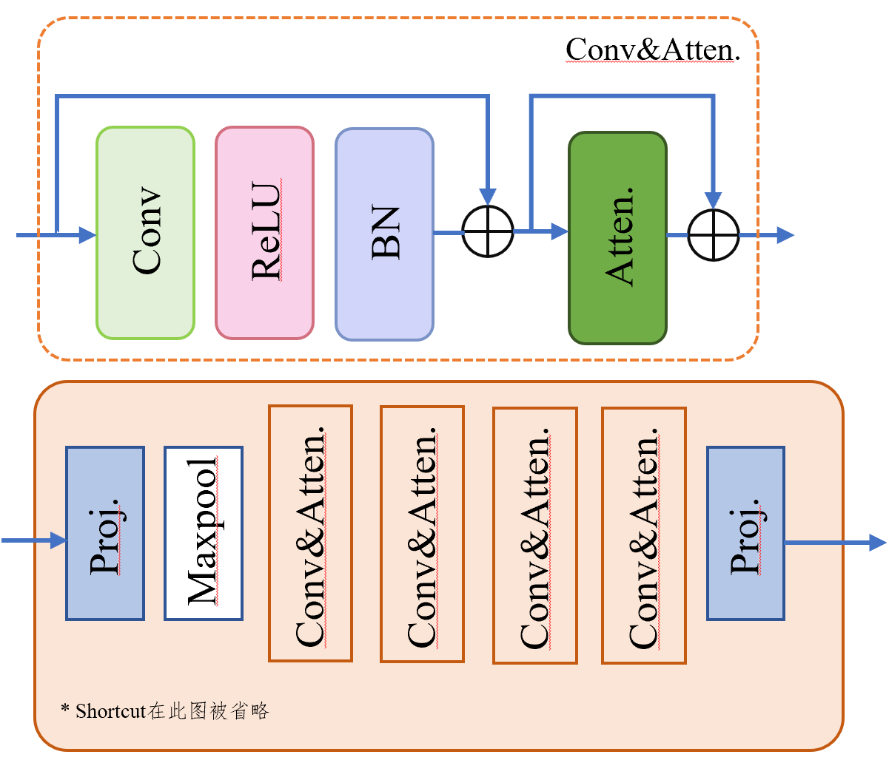
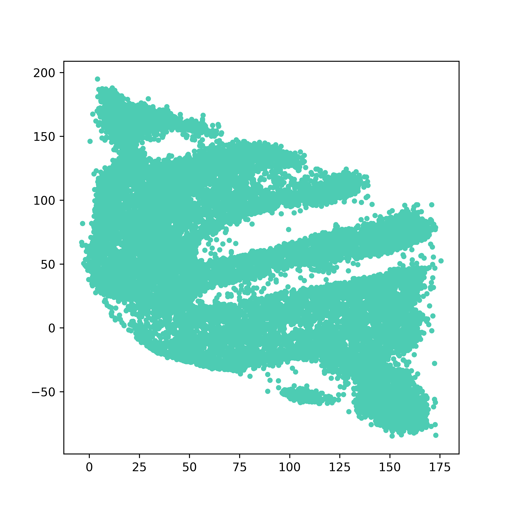
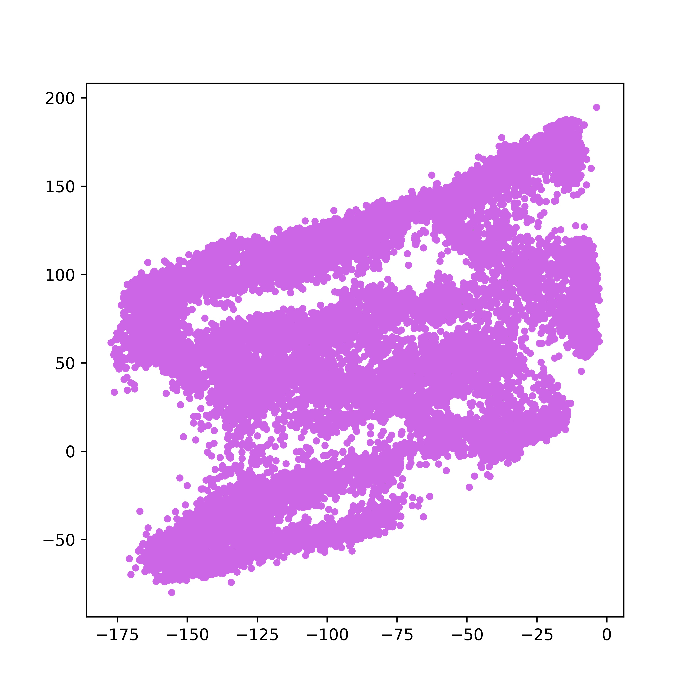
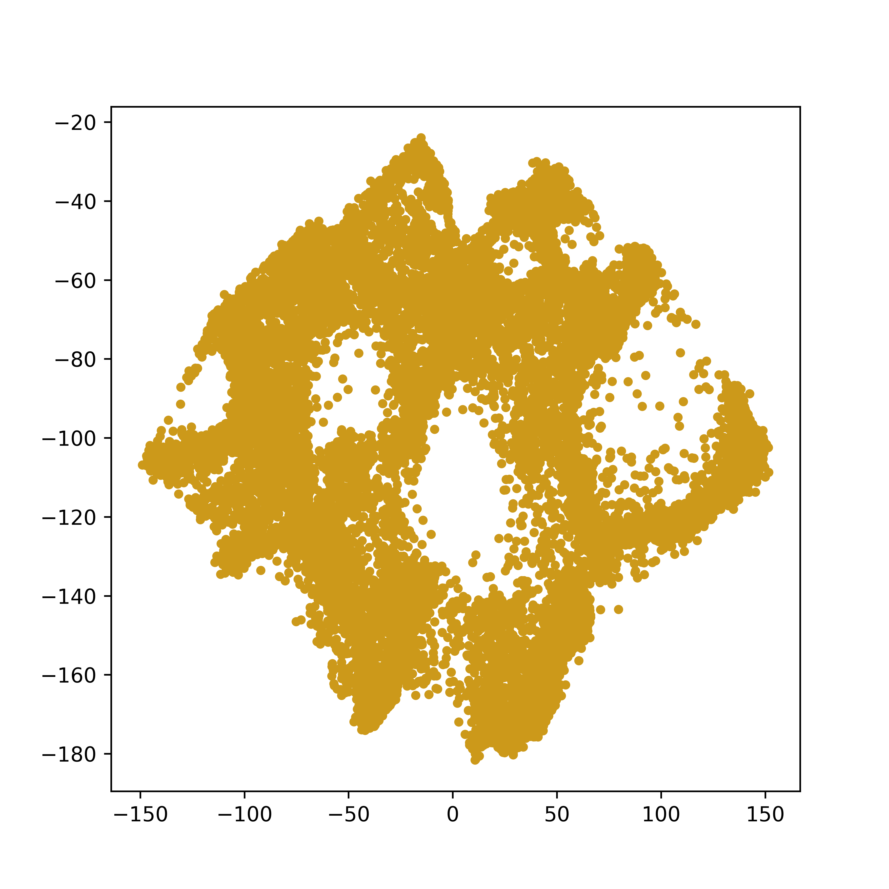

算法设计文档

**队名：winkwink**

## 算法原理

本设计依赖深度模型直接回归坐标值进行训练，主要原理分为三部分：1）数据预处理（将原始数据转换为易于模型提取特征和训练的张量数据）；2）深度网络的设计；3）loss函数的设计。这种直接回归坐标的方式是简单且直接的，并且在比赛中，本设计发现比指导书中的triplet loss和dual loss能够取得更好的性能。

## 算法流程

本算法设计遵循下面的设计流程：

- 在训练过程中：1）数据预处理，将原始数据处理为张量训练数据供深度模型进行学习特征并进行回归；2）送入模型并得出结果；3）计算loss，使用Adam优化算法进行模型参数优化。
- 在推理过程中：1）首先将数据进行预处理（与训练过程相同）;2）送入训练好的网络进行推理。

<figure style="text-align: center;">
    
    <figcaption>图1：流程图。</figcaption>
</figure>
值得注意的是，在Round3中，由于带有标签的训练数据过少，我们使用了Round2的数据一起进行了训练，将他们同一旋转至第一扇区下进行预处理，这样就可以将多个Round的数据一起进行训练。

> 当然在转换扇区后，在推理时也需要将模型预测值旋转到之前的扇区。

下面，本设计将分小节进行阐述。

### 数据预处理

预处理是对于深度模型来说是一个重要的部分，好的预处理的数据可以让模型更好的收敛和更佳的效果。

1. 首先，每一行的数据view成$(2,408,64,2)$，将第一维拆开实部和虚部相加为complex128 array，并permute为$(2,64,408)$；
1. 然后在408这个维度上做64点的快速傅里叶变换IFFT，IFFT之后的数据shape为$(2,64,64)$，再reshape为$(2,64,2,2,4,8)$（分别是2极化，4俯仰角和8水平角）；
1. 再在最后两维上做FFT，得到数据shape为$(64,2,2,64,64)$，再将中间为2的两个维度concate，permute为$(4,64,64,64)$的张量，这样将20000个数据stack到一起存为h5文件，数据shape为$(20000,4,64,64,64)$。

*如需验证模型效果，我们提供了已经预处理过的数据以供下载【[百度云盘]()】.*

### 深度模型搭建

预测的结果很大程度对依赖于深度模型的结构，本设计设计了一种卷积与Attention机制结合的深度网络，深度网络结构图如下所示。

<figure style="text-align: center;">
    
    <figcaption>图2：深度网络架构图。</figcaption>
</figure>

首先，shape为$(bs,4,64,64,64)$的数据被送入网络后，先会被投影到高维（64），然后再maxpool将张量的空间尺寸将为32，随后送入Conv&Atten. block中进行特征的抽取，一共四层，他们的维度分别为$(64, 128, 256, 512)$，最后抽取的特征在空间维度上求均值之后之后，送入最后一层投影至2维，进行坐标回归。

Attention操作的数学表示如下：
$$
\begin{align}
q,k,v&=Conv(x),\\
A&=(q\cdot k^\top)/\sqrt{n\_head},\\
SA &= Softmax(A),\\
out&=SA\cdot v^\top,
\end{align}
$$
其中，$x$为输入特征，out为输出特征。由此对输入特征$x$进行特征提取和回归建模。

### loss函数计算

对于loss函数，本设计选择直接回归坐标进行深度网络的学习，具体来说，对于ground truth的两个坐标，loss计算为：
$$
\mathcal L_1=\|\hat x-x\|_1+\|\hat y -y\|_1,
$$

其中，$\hat x, \hat y$分别是模型预测值，$x,y$是ground truth。

## 预测结果

线下测试详见代码 README.md。

本节给出决赛阶段模型预测的可视化结果

*Pos1*:

*pos2*:

*pos3*:

